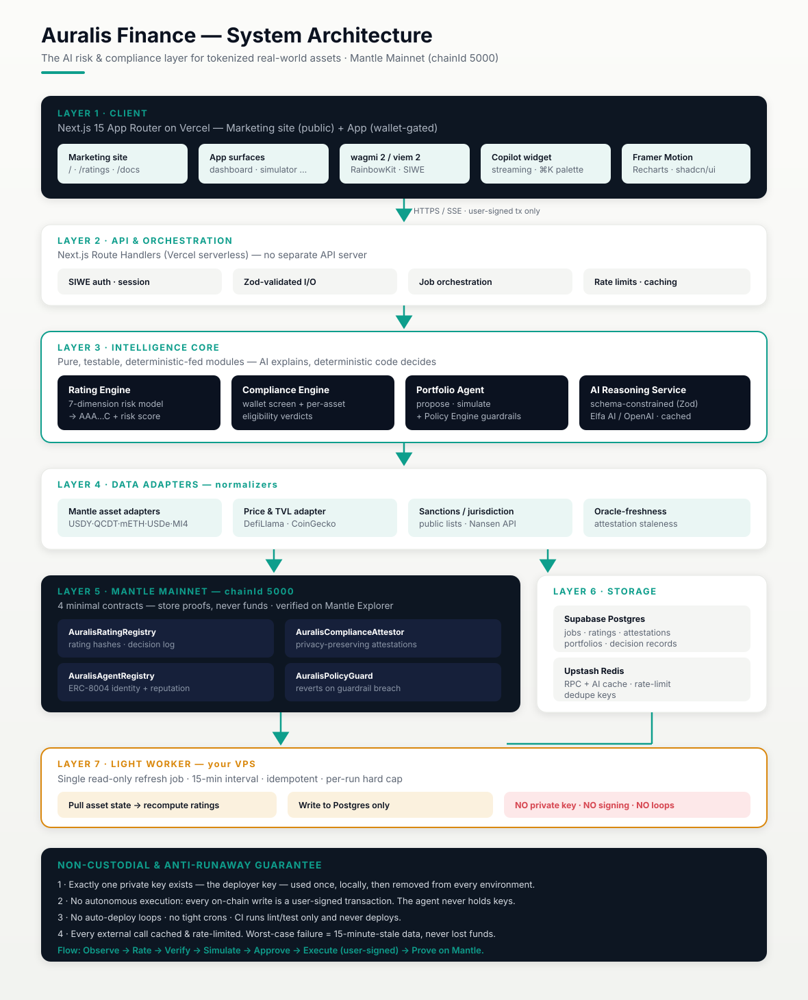
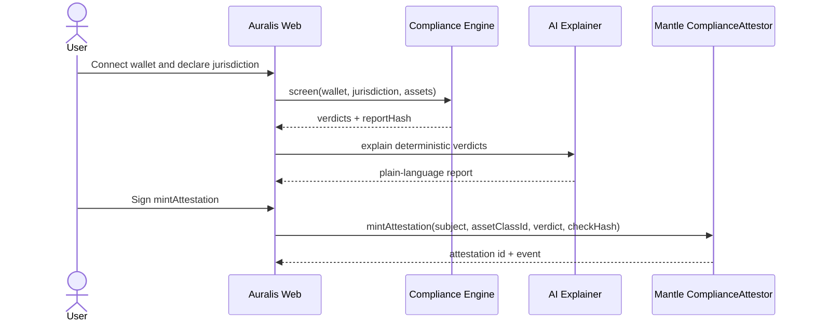
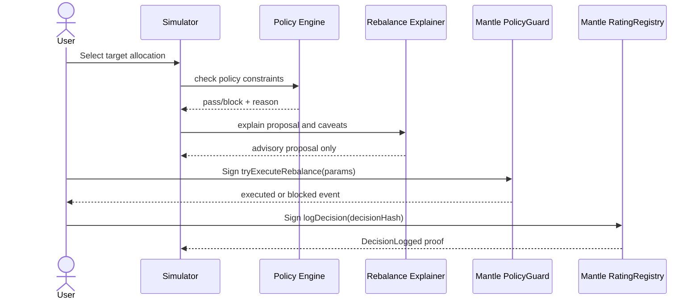

# Auralis Architecture

Purpose: explain the seven-layer Auralis system, the three golden paths, and why Mantle is the trust-settlement layer.

Related docs: [Risk Methodology](./RISK_METHODOLOGY.md), [Compliance Framework](./COMPLIANCE_FRAMEWORK.md), [Agent Design](./AGENT_DESIGN.md), [Contracts](./CONTRACTS.md), [API](./API.md), [Security](./SECURITY.md).



## System principle

Auralis separates explanation from authority. Deterministic code computes ratings, compliance verdicts, policy checks, hashes, and on-chain calls. AI receives those completed vectors and produces explanations or proposals only. Mantle stores the durable proof: rating hashes, compliance attestations, guarded decisions, and agent identity references.

## The seven layers

1. **Mantle asset layer** — USDY, QCDT, mETH/cmETH, USDe, MI4-style index exposure, Aave-on-Mantle, and Merchant Moe are the live subject matter. Auralis does not tokenize assets; it rates and governs the assets Mantle already makes available.
2. **Signal adapter layer** — `packages/adapters` normalizes asset price, TVL, liquidity depth, proof freshness, peg deviation, contract age, concentration, oracle freshness, and issuer tags into one risk vector.
3. **Deterministic intelligence layer** — `packages/core` computes the seven-dimension risk score, grade, risk-adjusted APY, compliance verdicts, policy outcomes, and stable hashes.
4. **AI explanation layer** — `packages/core/src/ai` routes to Elfa/OpenAI when configured and otherwise uses offline templates. Model output is Zod-validated and cached by input hash.
5. **Application/API layer** — `apps/web` exposes the app surfaces and public API routes for ratings, eligibility, methodology, health, copilot, portfolio, and decisions.
6. **Proof and settlement layer** — four Mantle mainnet contracts anchor ratings, compliance attestations, agent identity, and policy-guarded decisions.
7. **Operations and documentation layer** — Sentry, `/api/health`, docs, judge guide, test reports, and the read-only worker make the system inspectable without adding custody or server-side signing.

## Component responsibilities

| Component | Responsibility | Writes on-chain? | Safety boundary |
|---|---|---:|---|
| `packages/adapters` | Gather and normalize Mantle asset signals | No | Read-only data normalization |
| `packages/core/rating` | Compute dimension scores, grade, risk-adjusted yield, rating hash | No | Deterministic and reproducible |
| `packages/core/compliance` | Screen wallet, classify asset, produce verdict report and check hash | No | Tooling, not legal advice |
| `packages/core/policy` | Check proposed rebalances against hard guardrails | No | No autonomous execution |
| `packages/core/ai` | Explain results and draft proposals from deterministic vectors | No | Zod schema + provenance hash |
| `apps/web` | UI, public APIs, wallet-signed calls | User-signed only | No server private key |
| `apps/worker` | Scheduled read-only refresh/indexing work | No | No keys, no deploy authority |
| Mantle contracts | Store proofs and guardrail records | Yes, by user/deployer calls | No custody, no fund movement |

## Golden path 1 — compliance scan → attestation mint



## Golden path 2 — simulate → guarded rebalance → decision proof



## Golden path 3 — rating refresh worker

```mermaid
sequenceDiagram
  participant Worker as Read-only Worker
  participant Adapters as Mantle Adapters
  participant Core as Rating Engine
  participant AI as Explanation Router
  participant Registry as Mantle RatingRegistry
  Worker->>Adapters: Pull current signals
  Adapters-->>Worker: canonical signal vector
  Worker->>Core: rateAsset(vector)
  Core-->>Worker: score, grade, ratingHash
  Worker->>AI: explain completed rating
  AI-->>Worker: rationale + provenance hashes
  Worker-->>Registry: No autonomous write; publisher/user anchors explicitly
```

## Why Mantle — and why this could not run on a generic L2

Auralis is Mantle-specific in the object being rated, the proof layer, and the economics. The target assets are Mantle's RWA/yield stack: USDY, QCDT, MI4-style index products, mETH/cmETH, Aave-on-Mantle, and Merchant Moe liquidity. The product complements Mantle TaaS by making tokenized assets legible, compliance-aware, and auditable after issuance.

Mantle mainnet is also the settlement layer for trust. Auralis writes small proofs often: rating hashes, compliance attestations, decision hashes, and policy outcomes. That pattern needs low-cost mainnet finality. On a high-cost generic L1 this proof density would be economically irrational; on Mantle it is the product's core affordance.

Finally, Mantle's hackathon ERC-8004 agent-identity primitive gives Auralis a natural agent reputation hook. Auralis consumes Mantle identity rather than inventing a competing standard.

## Vercel-only app + read-only worker

The web app runs on Vercel for public reach and simple preview deployments. The worker is intentionally read-only and keyless: it can refresh signals and precompute reports, but it cannot deploy, sign, or move funds. This architecture keeps the demo reliable while preserving the non-custodial claim described in [Security](./SECURITY.md).
